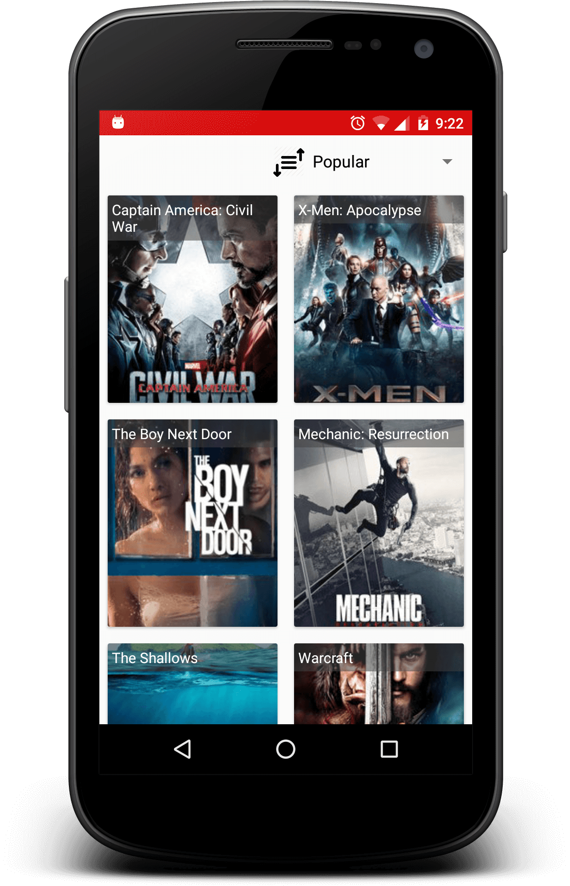
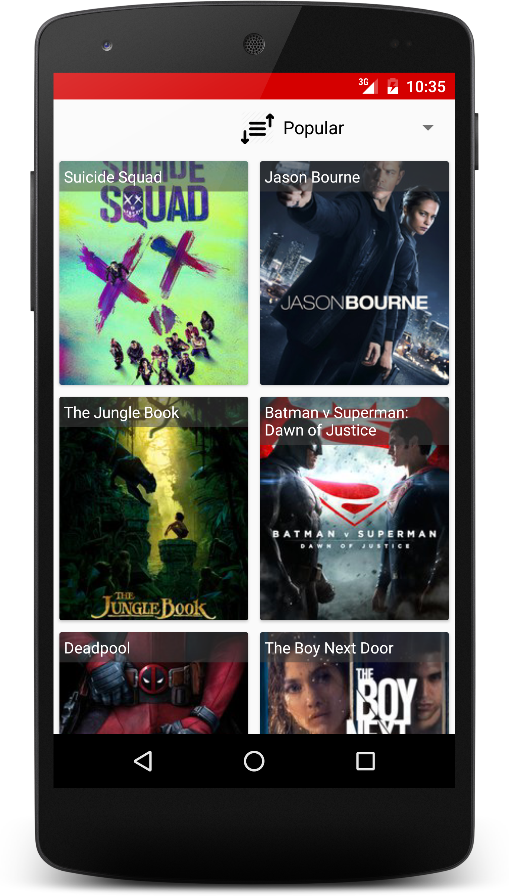
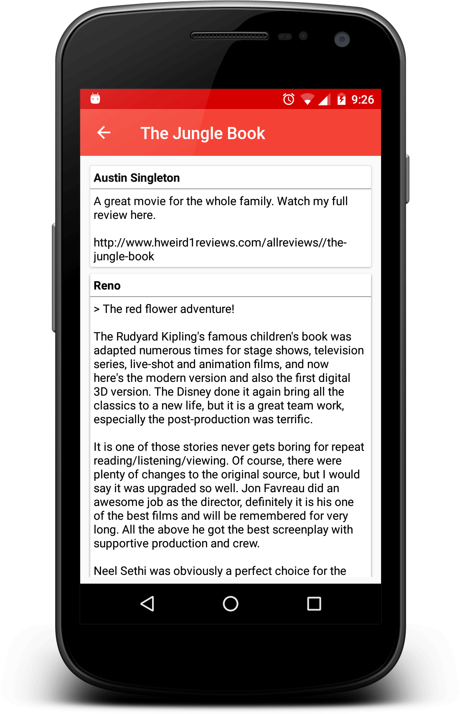
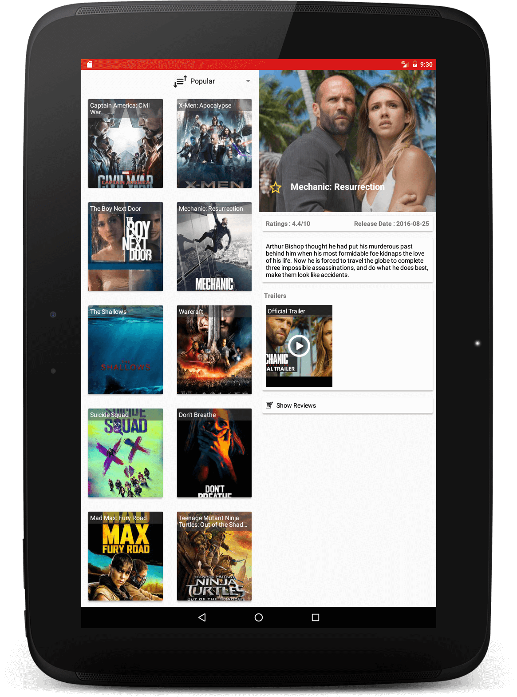
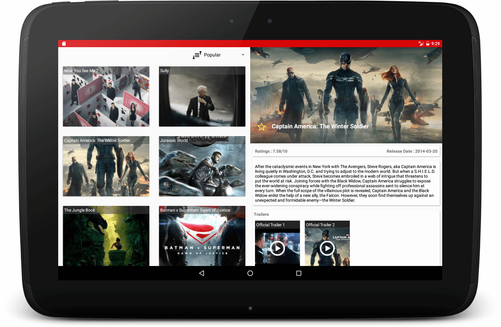

# PopularMovie App
==================

An Android app, that helps user to discover movies. 
This is Project 1 & Project 2 of Udacity's Android Developer Nanodegree.

**Features:**

- Explore the most popular, the highest rated and the upcoming movies
- Watch movie trailers
- Read reviews from other users
- Mark movies as favorites
- Material design support
- Phone and tablet resolution support

Screenshots
-----------








Developer setup
---------------

### Requirements

- Java 8
- Latest version of Android SDK and Android Build Tools

### API Key

The app uses themoviedb.org API to get movie information and posters. You must provide your own [API key][1] in order to build the app.

Just put your API key into "com.portfolio.archit.popularmovie.data.AppConstants.java" file:

```API_KEY
MOVIE_DB_API_KEY="xyz"
```

License
-------

    Copyright 2016 Archit Shah

    Licensed under the Apache License, Version 2.0 (the "License");
    you may not use this file except in compliance with the License.
    You may obtain a copy of the License at

       http://www.apache.org/licenses/LICENSE-2.0

    Unless required by applicable law or agreed to in writing, software
    distributed under the License is distributed on an "AS IS" BASIS,
    WITHOUT WARRANTIES OR CONDITIONS OF ANY KIND, either express or implied.
    See the License for the specific language governing permissions and
    limitations under the License.

[1]: https://www.themoviedb.org/documentation/api
